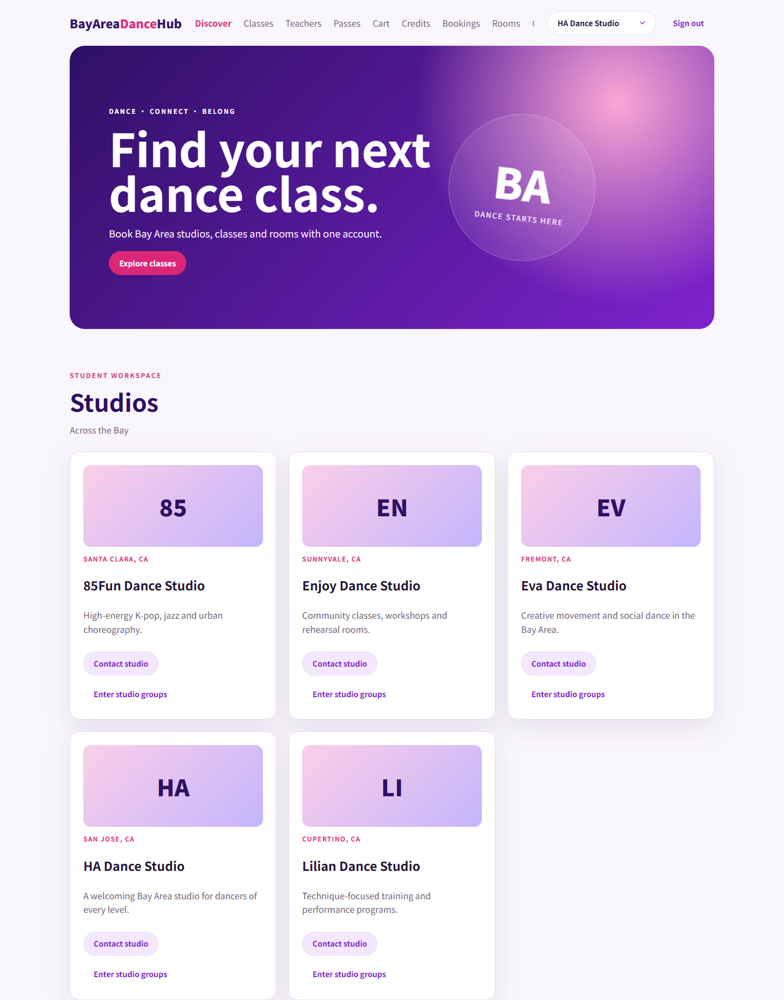
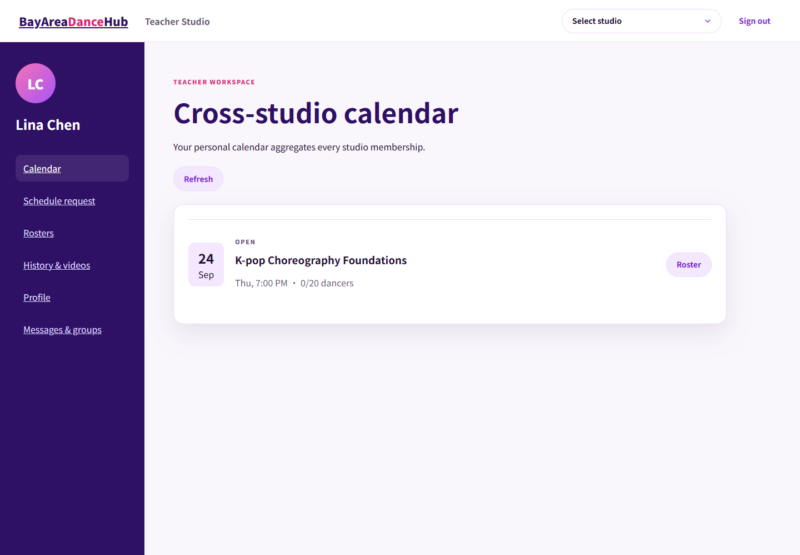
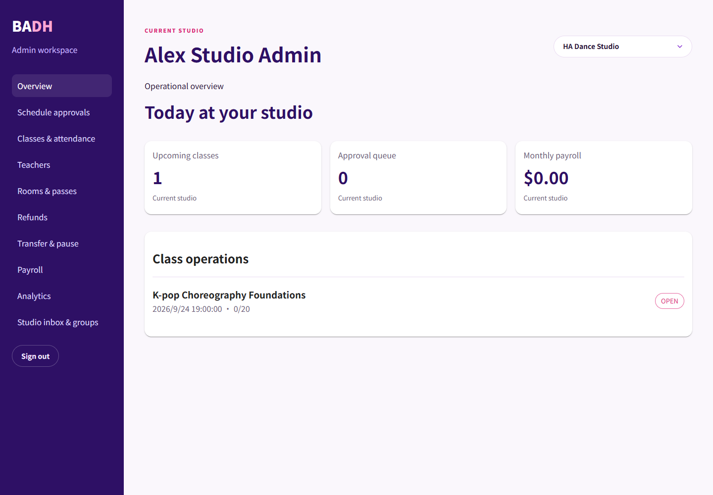
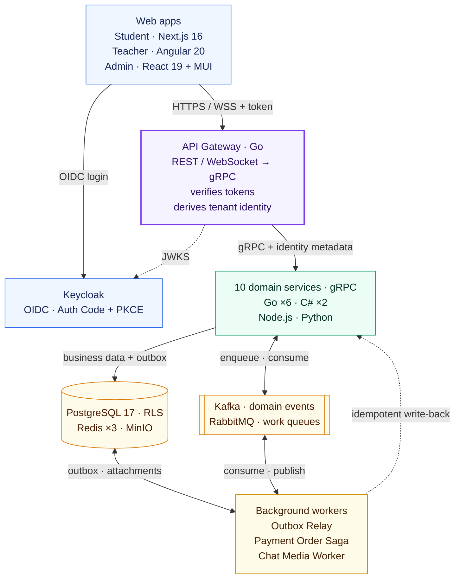
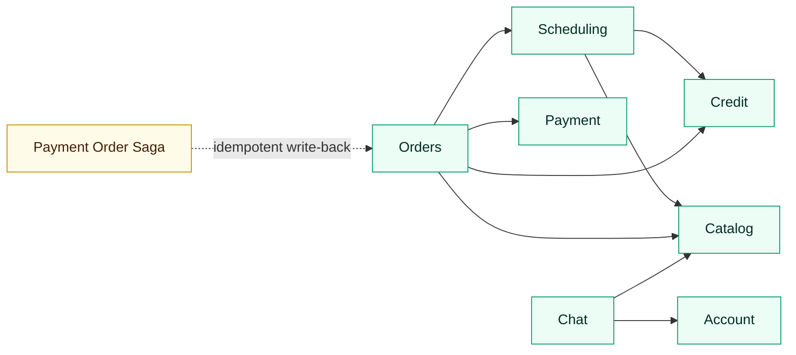
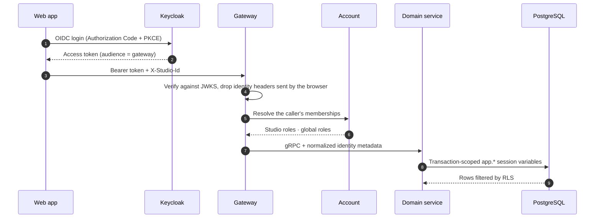
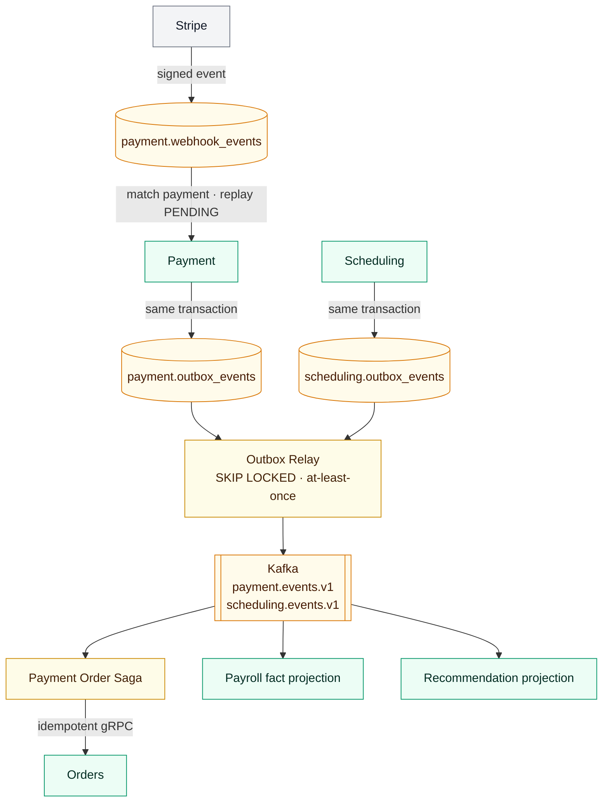
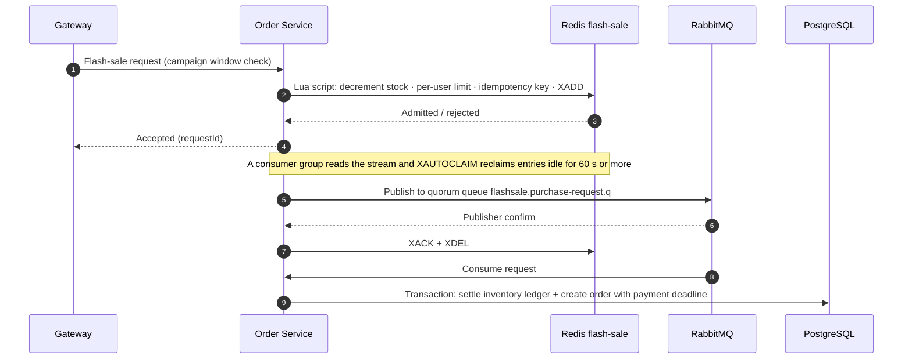
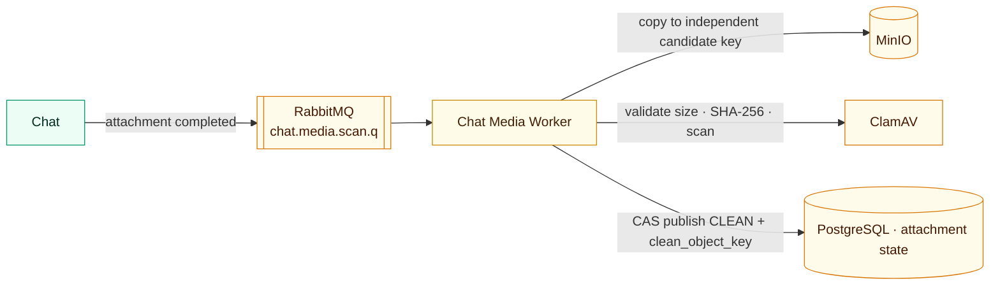
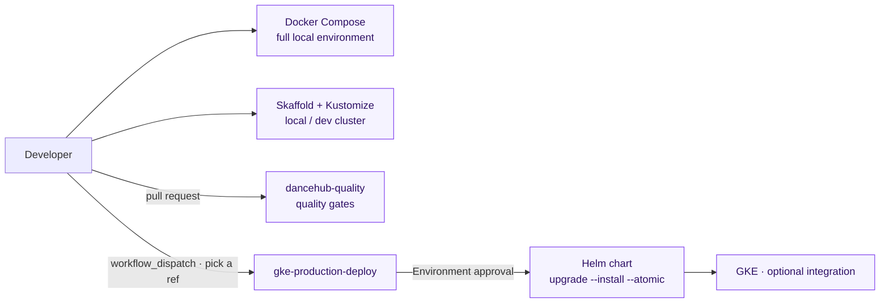

# BayAreaDanceHub

A class, room and membership platform for a network of dance studios across the San Francisco Bay Area. Students browse studios and credit packs, book classes, check out with a cart and locally simulated payments, reserve rooms, join limited flash sales and chat with teachers. Teachers manage schedule requests, rosters and attendance. Studio administrators handle approvals, refunds, payroll, members and platform roles.

The system consists of three role-specific web applications, an API gateway written in Go, ten domain services in four languages and three background workers. Business APIs pass through the gateway, which authenticates every request and calls the domain services over gRPC; login is delegated to Keycloak, and attachments go straight to object storage through presigned URLs. PostgreSQL is split into one schema per domain with row-level security (RLS) as a second layer of isolation; Redis holds carts, flash-sale admission and real-time fan-out; Kafka carries domain events and RabbitMQ carries work queues. The production configuration binds service-to-service calls to Istio / Cloud Service Mesh workload identity.

The local Compose environment is a complete demo with Keycloak and simulated payments. Stripe, Helm/GKE and the service mesh are optional integrations; see [Scope and limits](#scope-and-limits).

## Screenshots

**Student Web (Next.js 16)**: studio discovery, class booking, credit packs and orders, flash-sale admission, room reservations and chat with teachers.



| Teacher Web (Angular 20): cross-studio calendar, schedule requests, rosters and attendance | Admin Web (React 19 + MUI): approvals, attendance audit, refunds, payroll and operating metrics |
| :----------------------------------------------------------------------------------------: | :---------------------------------------------------------------------------------------------: |
|                      |                                |

The screenshots come from the local Compose environment at a 1440px desktop width, using the built-in demo data in [`database/seed/local.sql`](./database/seed/local.sql). All three apps share design tokens and native control styles from `@dancehub/ui`; the admin app overrides the MUI Button theme to match.

## Core capabilities

- Multi-studio, multi-role identity: the current studio role (`student` / `teacher` / `studio_admin`), global roles (`platform_admin`) and background service identities are modeled separately.
- Class search, booking, cancellation, attendance, walk-in backfill and independent redemption reversal; the minimum class size is decided uniformly before the class starts; classes, personal bookings and rosters support stable cursor pagination.
- Regular credit packs and unlimited passes: entitlement issuance, holds and redemption, transfer, pause and refund eligibility.
- Room reservations, order creation, Stripe PaymentIntent and refund APIs; webhook signature verification, event persistence, deduplication and replay of `PENDING` events.
- Limited flash sales: atomic admission in a Redis Lua script → message queue → final settlement in the PostgreSQL inventory ledger.
- Direct messages, studio group chats, real-time WebSocket messaging (read receipts are written and broadcast only when the sequence advances), presigned attachment uploads and virus scanning.
- Class completion and later redemption adjustments drive the teacher payroll fact projection with auto-refreshing reports in the admin app; studio operating metrics; OpenTelemetry tracing across browsers, services and database calls.

## Architecture

### Overview



| Layer                  | Components                                                                                                              | Responsibility                                                                                                                                                    |
| ---------------------- | ----------------------------------------------------------------------------------------------------------------------- | ----------------------------------------------------------------------------------------------------------------------------------------------------------------- |
| **Web apps**           | Student Web (Next.js 16), Teacher Web (Angular 20), Admin Web (React 19 + MUI)                                          | One entry point per role; sign in through Keycloak, keep the session and the selected studio; authorization is derived server-side                                |
| **API Gateway**        | Go `net/http`: 71 business HTTP routes and 1 WebSocket, plus 2 telemetry routes, 1 webhook and 1 health check           | Verifies tokens, strips internal identity headers a browser could forge, resolves memberships through Account and places the normalized identity in gRPC metadata |
| **Domain services**    | Account, Catalog, Scheduling, Orders, Payroll, Chat (Go); Credit, Cart (C#); Payment (Node.js); Recommendation (Python) | Persistent domains are isolated by schema and database role; six services use a domain model with ports and adapters; Cart uses its own Redis                     |
| **Data and messaging** | PostgreSQL 17, Redis ×3, Kafka, RabbitMQ, MinIO, ClamAV                                                                 | PostgreSQL holds the business ledgers; Redis holds transient state and requests awaiting relay; Kafka propagates events and RabbitMQ distributes tasks            |
| **Background workers** | Outbox Relay and Payment Order Saga (Python); Chat Media Worker (Go)                                                    | Publish the outbox to Kafka, synchronize payment results into orders, scan chat attachments                                                                       |

### Service dependencies

The gateway calls all ten domain services and calls Payment directly to create payments. Synchronous RPC dependencies between domain services are shown below; the asynchronous event flow is covered in [Events, consistency and recovery](#events-consistency-and-recovery).



- **Scheduling → Credit / Catalog**: places a hold on credit-pack balance at booking time and reads rooms and the class catalog.
- **Orders → Credit / Scheduling / Catalog / Payment**: issues entitlements on fulfillment, confirms room occupancy, reads product snapshots, and queries and refunds payments.
- **Chat → Account / Catalog**: resolves the public identity of chat participants and validates studio group membership.
- Payroll, Cart and Recommendation have no downstream business RPCs; Payroll and Recommendation consume scheduling events from Kafka, and the Payment Order Saga writes back to Orders through idempotent gRPC calls.

### Data and messaging ownership

| Component                            | Used by                                                                                | Contents and constraints                                                                                                                                              |
| ------------------------------------ | -------------------------------------------------------------------------------------- | --------------------------------------------------------------------------------------------------------------------------------------------------------------------- |
| PostgreSQL 17                        | 9 persistent domain services, Outbox Relay, Chat Media Worker                          | 11 schemas (9 business domains, `app_security`, `keycloak`), 15 login roles (including migration and infrastructure roles), 46 tables with `FORCE ROW LEVEL SECURITY` |
| Redis · cart                         | Cart                                                                                   | Cart state; read-modify-write committed through conditional transactions (CAS) with retries; 7-day sliding expiry; may be lost                                        |
| Redis · flash-sale                   | Orders                                                                                 | Atomic Lua admission (stock, per-user limit, idempotency key) and a stream of requests awaiting relay; AOF, a persistent volume and `noeviction` locally              |
| Redis · chat                         | Chat                                                                                   | WebSocket event pub/sub and presence, `allkeys-lru`                                                                                                                   |
| Kafka 4 (KRaft)                      | Outbox Relay → Payroll, Recommendation, Payment Order Saga                             | `scheduling.events.v1` and `payment.events.v1`, 3 partitions, replayable; consumers deduplicate with inbox tables                                                     |
| RabbitMQ 4                           | Orders (flash-sale requests), Chat → Chat Media Worker (attachment scanning)           | `flashsale.purchase-request.q` (the KEDA scaling signal), `chat.media.scan.q` with retry and dead-letter queues                                                       |
| MinIO / S3-compatible object storage | Chat, Chat Media Worker                                                                | Quarantined upload → independent candidate copy → scan → CAS publish; download URLs are issued only for the pinned `CLEAN` copy                                       |
| ClamAV                               | Chat Media Worker                                                                      | Attachment virus scanning; attachments whose scan fails stay unavailable                                                                                              |
| OpenTelemetry Collector              | Backend services and browsers (browsers relay through the gateway's `/v1/telemetry/*`) | Traces are exported to Jaeger; Prometheus scrapes metrics in Compose, while Kustomize only exposes the metrics endpoint                                               |

## Service inventory

The full environment runs 17 long-lived first-party containers; PostgreSQL, Redis, Kafka, RabbitMQ, Keycloak, MinIO, ClamAV and the observability components run as local infrastructure.

### Web applications

| Service                           | Stack                      | Responsibility                                                                     |
| --------------------------------- | -------------------------- | ---------------------------------------------------------------------------------- |
| [student-web](./apps/student-web) | Next.js, React, TypeScript | Classes, bookings, entitlements, orders, flash sales, rooms and chat               |
| [teacher-web](./apps/teacher-web) | Angular, RxJS, TypeScript  | Schedule requests, calendar, rosters, attendance, class videos and chat            |
| [admin-web](./apps/admin-web)     | React, Vite, MUI           | Studio operations, attendance audit, refunds, payroll and platform role management |

### API and domain services

| Service                                                   | Language | Responsibility                                                                       | Main dependencies                                                 |
| --------------------------------------------------------- | -------- | ------------------------------------------------------------------------------------ | ----------------------------------------------------------------- |
| [gatewayservice](./src/dancehub/cmd/gatewayservice)       | Go       | REST/WebSocket entry point, OIDC, tenant identity derivation and backend aggregation | Keycloak, every public gRPC service                               |
| [accountservice](./src/dancehub/cmd/accountservice)       | Go       | User profiles, studio memberships, global roles and identity resolution              | PostgreSQL                                                        |
| [catalogservice](./src/dancehub/cmd/catalogservice)       | Go       | Studios, rooms, credit products and campaign catalog                                 | PostgreSQL                                                        |
| [cartservice](./src/cartservice)                          | C#       | Per-user carts and item quantity limits                                              | Redis (cart)                                                      |
| [creditservice](./src/creditservice)                      | C#       | Entitlement issuance, holds, redemption, transfer, pause and refund eligibility      | PostgreSQL                                                        |
| [schedulingservice](./src/dancehub/cmd/schedulingservice) | Go       | Scheduling, bookings, room occupancy, attendance and post-class confirmation         | PostgreSQL, Credit, Catalog                                       |
| [orderservice](./src/dancehub/cmd/orderservice)           | Go       | Orders, refunds, room orders and flash-sale inventory settlement                     | PostgreSQL, Redis, RabbitMQ, Credit, Scheduling, Catalog, Payment |
| [paymentservice](./src/paymentservice)                    | Node.js  | Stripe/fake payments, webhooks, refunds and the payment outbox                       | PostgreSQL, Stripe                                                |
| [payrollservice](./src/dancehub/cmd/payrollservice)       | Go       | Consumes class facts, maintains the payroll projection and computes pay              | PostgreSQL, Kafka                                                 |
| [chatservice](./src/dancehub/cmd/chatservice)             | Go       | Conversations, groups, messages, WebSocket, blocks, reports and the attachment flow  | PostgreSQL, Redis, RabbitMQ, MinIO, Account, Catalog              |
| [recommendationservice](./src/recommendationservice)      | Python   | Consumes scheduling events and serves studio operating metrics                       | PostgreSQL, Kafka                                                 |

### Background workers

| Service                                                 | Language | Responsibility                                                         | Main dependencies                   |
| ------------------------------------------------------- | -------- | ---------------------------------------------------------------------- | ----------------------------------- |
| [chat-media-worker](./src/dancehub/cmd/chatmediaworker) | Go       | Scans attachments and updates their availability                       | RabbitMQ, ClamAV, MinIO, PostgreSQL |
| [outbox-relay](./src/eventrelay)                        | Python   | Publishes the Scheduling and Payment outboxes to Kafka                 | PostgreSQL, Kafka                   |
| [payment-order-saga](./src/eventrelay)                  | Python   | Idempotently synchronizes payment results into the order state machine | Kafka, Order Service                |

## Technology stack

### Design principles

1. **One contract, many languages**: business RPCs are defined in Protobuf; Buf generates Go, C#, Python and OpenAPI artifacts for services and clients in every language.
2. **Sources of truth are separated from transient state**: orders, inventory and entitlement ledgers live in PostgreSQL, and the payment service records the outcomes reported by the payment provider. Redis handles carts, admission caching, stream relay and real-time fan-out; flash-sale requests that have not yet reached the database are not treated as a disposable cache.
3. **Defense in depth**: the gateway verifies identity and RLS adds isolation at the database; Kubernetes network policies rely on a CNI that enforces them, and the production mesh configuration additionally binds workload identity to service-to-service calls.
4. **Declare once, apply everywhere**: the Helm `allowedCallers` list generates the NetworkPolicies, the Istio AuthorizationPolicies and each service's caller allowlist, so the production configuration cannot drift.

### Choices by layer

| Layer                  | Choice                                                                                | How it is used                                                                                                                                                                                                                          |
| ---------------------- | ------------------------------------------------------------------------------------- | --------------------------------------------------------------------------------------------------------------------------------------------------------------------------------------------------------------------------------------- |
| Web frontends          | Next.js 16 / React 19, Angular 20, Vite + MUI                                         | Route-level lazy loading in all three apps; shared `@dancehub/api-client`, `telemetry` and `ui` packages; `@dancehub/auth` serves Teacher / Admin only, Student uses Auth.js                                                            |
| Identity               | Keycloak, OIDC Authorization Code + PKCE, Auth.js                                     | Student Web is a confidential client (server-side token exchange); Teacher / Admin are PKCE public clients; tokens carry the `gateway` audience                                                                                         |
| API entry point        | Go `net/http`, gorilla/websocket, go-oidc                                             | 71 business HTTP routes and 1 WebSocket mapped onto gRPC, plus telemetry, webhook and health endpoints; strips forged identity headers and derives roles                                                                                |
| Service contracts      | Protobuf, gRPC, Buf, grpc-gateway, OpenAPI v2/v3                                      | 10 business gRPC services with 96 RPCs (including the bidirectional chat stream, excluding health); Buf generates Go, C#, Python, gateway and Swagger v2 output, and `npm run generate:api-types` derives OpenAPI v3 and `openapi.d.ts` |
| Go services            | Go 1.25, pgx                                                                          | Account, Catalog, Scheduling, Orders, Payroll, Chat, plus the gateway and the Chat Media Worker                                                                                                                                         |
| Entitlements and carts | C# / .NET 9, Npgsql, StackExchange.Redis                                              | Credit (pack balances, holds and redemption, transfers, refund rules) and Cart (Redis carts); Cart ships as a trimmed single-file publish                                                                                               |
| Payments               | Node.js 22, Stripe SDK, pg                                                            | PaymentIntent creation and refunds, webhook verification, `webhook_events` persistence, `PENDING` replay, timestamp filtering and protection of terminal refund states                                                                  |
| Projections and saga   | Python 3.13 (Relay / Saga), 3.14.6 (Recommendation image), psycopg 3, kafka-python-ng | Outbox Relay (`FOR UPDATE SKIP LOCKED` batch publishing), Payment Order Saga (idempotent order write-back), Recommendation projection                                                                                                   |
| Persistence            | PostgreSQL 17                                                                         | Domain services are partitioned by schema and runtime role; database constraints, outbox / inbox tables and RLS complement application-level authorization                                                                              |
| Transient state        | Redis 7 ×3                                                                            | Carts, flash-sale admission (atomic Lua script + stream relay), chat pub/sub and presence, each on its own instance with its own eviction policy                                                                                        |
| Messaging              | Kafka 4 (KRaft), RabbitMQ 4                                                           | Kafka domain events deduplicated through inbox tables; RabbitMQ carries flash-sale requests and attachment scans, the latter with dedicated retry and dead-letter queues                                                                |
| Files                  | MinIO / S3-compatible object storage, ClamAV                                          | Presigned quarantined upload → copy to an independent candidate → validate and scan → CAS publish of `clean_object_key` → deferred cleanup of unpublished objects                                                                       |
| Observability          | OpenTelemetry SDKs in 4 languages, Collector, Jaeger, Prometheus                      | Consistent `service.name` and environment attributes across backends and browsers; tracing on HTTP/gRPC, SQL and Kafka; metrics coverage varies by language                                                                             |
| Delivery               | Docker Compose, Skaffold, Kustomize, Helm, GitHub Actions                             | Local Compose, local / dev Kustomize, and the optional Helm/GKE integration with mesh policies that requires external infrastructure                                                                                                    |
| Quality gates          | ESLint, Prettier, go test, xunit, node:test, unittest, Playwright, kubeconform        | Domain, concurrency, security and mesh-identity tests in every language, frontend policy and chat client tests, four-role E2E, and schema validation of rendered manifests                                                              |

The domain model and ports-and-adapters layering described in [ADR-001](./docs/adr/ADR-001-oop-domain-model.md) apply to six services: Account, Catalog, Scheduling, Orders, Credit and Chat. Cart coordinates validation, mutation and retries inside its gRPC service with storage behind `ICartStore`; Payroll queries and calculates in its gRPC handler while a separate [`projection` package](./src/dancehub/internal/payroll/projection) consumes Kafka and writes facts. Neither of those two adopts aggregates or an application layer.

## Key design

### Identity and multi-tenant authorization



Each step trusts only what the previous step has already verified:

1. **Web apps** keep the login session and the selected studio; they never supply roles the server would trust. Teacher and Admin are PKCE public clients that keep the access, ID and refresh tokens in sessionStorage; Student Web is an Auth.js confidential client that exchanges tokens server-side and hands the access token to the browser API client.
2. **The gateway** verifies the token against JWKS (the audience must be `gateway`), removes any `X-Tenant-Roles`, `X-Global-Roles`, `X-Actor-Kind` or `X-Service-Principal` header a browser might forge, and then resolves the caller's memberships through Account.
3. **Identity is split into four orthogonal parts**: `TenantRoles` (valid only for the current studio: `student` / `teacher` / `studio_admin`), `GlobalRoles` (`platform_admin`), `ActorKind` (`human` / `service`) and `ServicePrincipal` (a worker identity such as `scheduling-worker`). A platform administrator can enter any studio, but global roles never leak into studio roles, and a worker never impersonates a human administrator.
4. **Domain services backed by PostgreSQL** write the identity into transaction-scoped `app.*` session variables and let RLS enforce permissions at the database; Cart uses Redis. The gateway re-resolves authorization on every request and never caches roles. Data that a service identity may access still requires application-level checks of the human caller's business permissions; RLS alone is not sufficient.

On logout or session expiry the shared API client clears cached identity from memory, sessionStorage and localStorage. Teacher and Admin use a generation check in the shared OIDC client to discard refresh responses that were started before logout and returned after it; Student Web creates a separate QueryClient per login subject, resolves the platform user ID through `/v1/me` before mounting the workspace, and on logout immediately unmounts the workspace and cancels and clears its queries. Payment queries check both order ownership and payment ownership, and the background order service reaches payments only through an explicit service identity.

The production configuration adds **workload identity**: every service runs under its own ServiceAccount, the mesh provides mTLS and SPIFFE identity, and the application layer checks that the peer identity forwarded by the mesh belongs to `allowedCallers` and binds each `service` principal to its ServiceAccount. Local Compose and Kustomize environments have no mesh, so that check stays disabled there. The full decision is recorded in [ADR-002](./docs/adr/ADR-002-internal-identity-trust-boundary.md).

### Data boundaries

Local and dev use a single PostgreSQL instance, but data is partitioned into schemas such as `account`, `catalog`, `scheduling`, `credit`, `orders`, `payment`, `payroll`, `chat` and `recommendation`. Each domain service that connects to PostgreSQL uses its own runtime role (`NOBYPASSRLS`) with grants limited to what it needs; the few cross-domain queries and invariants (chat identity resolution, message sequencing) are implemented as `SECURITY DEFINER` functions owned by two non-login roles.

RLS policies check the user, studio, tenant roles, global roles or service identity in the transaction variables, and [`database/tests/rls.sql`](./database/tests/rls.sql) runs isolation assertions in CI as the real database roles. `credit.grant_operations` grants runtime roles `SELECT, INSERT` only; platform administrators can record platform-level credit-pack operations with `studio_id IS NULL`, while studio administrators remain limited to their studio. The [security SQL checks](./database/tests/security_controls.sql) verify these grants together with the attachment publication and cleanup constraints, and the [payroll SQL checks](./database/tests/payroll.sql) verify fact versioning and projection role permissions.

Redis is never the source of truth for orders or entitlement ledgers that have reached the database: carts are transient; flash sales are settled by the PostgreSQL `flashsale_inventory_ledger`, although the admission stream carries accepted requests until they are persisted and therefore has to be protected and recovered; the chat Redis only handles live connections and transient fan-out.

### Events, consistency and recovery

State changes and their events are committed in the same transaction, published to Kafka by the relay and deduplicated by consumers through inbox tables. Stripe callbacks are persisted first and then matched to a payment; events that cannot be matched yet are kept as `PENDING` and replayed later.



- **Relay** reads the outbox in batches with `FOR UPDATE SKIP LOCKED` and can run with multiple replicas; `published_at` is set only after a successful publish, giving at-least-once delivery.
- **Saga** retries transient errors with bounded exponential backoff (the budget stays below Kafka's `max_poll_interval`), and logs and skips events that the order service rejects deterministically; `event_id` is the idempotency key, so redelivery never advances an order twice.
- **The Recommendation projection** accumulates metrics by the month in which an event occurred; the offset is committed only after each event is persisted, transient failures retry from the same offset without being overtaken by later commits, and only unparsable events are logged and skipped. A regular booking emits `BookingCreated` once its credit hold is confirmed, and it counts toward the studio's bookings metric together with walk-ins.
- **Payroll** consumes `ClassCompleted` fact snapshots: class completion and every later change to the redemption count produce an increasing `fact_version`, and each snapshot carries the studio timezone frozen at scheduling time, the local month, the approved duration and the effective redemption count. The consumer writes `payroll.inbox_events` and updates the fact by version in one database transaction; duplicates are deduplicated and older versions cannot overwrite newer ones. Offsets are committed manually: one record at a time, only after the database transaction commits, with rebalancing blocked during processing. If the database or the offset commit fails, the consumer is recreated from the last committed offset and the inbox absorbs the replay; invalid payroll facts are never skipped silently.
- **Stripe webhooks**: Stripe mode requires both the API secret and the webhook secret, otherwise the payment service refuses to start. A success event can advance a payment that failed earlier and is no longer ignored because of an identical second-level timestamp; a later failure event cannot overwrite a succeeded or refunded terminal state. The success time travels with the event to the order, which supports failure followed by success and idempotent fulfillment; a payment timeout, or a room that can no longer be fulfilled, moves the order into persisted refund compensation.

### Compensation and recovery

- **Refunds and cancellations**: a credit-pack refund first checks the order line quantities and atomically reserves the complete entitlement, then refunds the payment, then revokes the entitlement; direct administrator approval must go through the same reservation. The refund phase, next retry time, lease and last error are stored in `orders.refund_attempts`, and payment refunds use a stable idempotency key. Booking cancellations commit together with a `scheduling.credit_compensations` task; Credit records the cancellation marker, releases or reverses the entitlement idempotently, and prevents a late hold request from reoccupying the class credit. A failed task stays pending and never reports completion early.
- **Attendance and redemption**: recording an absence and reversing a redemption are independent operations. Walk-ins and reversals persist an operation with an idempotency key before calling Credit; if it does not complete, the caller receives a retryable status and a background task finishes it. The admin app keeps the same request key for identical form contents so a network failure can be retried safely, and the teacher app reuses the key of an unfinished attendance request. Before a class can be completed, its booking captures, cancellation compensations and attendance operations must all be settled, so incomplete payroll facts are never published.
- **Room occupancy**: classes and room rentals are written by database triggers into the same `scheduling.room_occupancies` table, where a GiST exclusion constraint rejects overlapping periods across both kinds of use; half-open intervals allow back-to-back slots.
- **Pagination**: classes, personal bookings and rosters return `24` items per page by default and at most `100`; HTTP uses `page_size` and `page_token`, and responses return `nextPageToken`. Classes are ordered by `(starts_at, id)` ascending, personal bookings by `(created_at, id)` descending and rosters by `(created_at, id)` ascending; the cursor is bound to the query scope and filters, and every page is re-authorized and filtered by RLS. `bookable_only=true` returns only classes that have not started, still have seats, are in a bookable state and have no active booking by the caller; Student Web uses this filter by default.

### Flash-sale admission



Redis only screens out the bulk of invalid traffic; the PostgreSQL inventory ledger is the final arbiter. `XACK` + `XDEL` run atomically only after a publisher confirm without a mandatory return, and in production KEDA scales `orderservice` on the queue length. A process that exits after publishing but before Redis acknowledges may cause duplicate delivery, which the consumer handles through the request idempotency key and the ledger. The repository includes a regression test against a real Redis in which a new consumer claims pending entries; it does not cover every Redis / RabbitMQ failure window or high-concurrency load.

### Attachment scanning

Clients only receive a PUT URL for a quarantined upload key. The worker first copies the object to an independent candidate key for which no upload permission is ever issued, then validates that copy's size, SHA-256 and virus-scan result, and finally publishes `clean_object_key` through a conditional update. Downloads use only the scanned copy, so re-uploading to the original PUT URL cannot change published content.



- Scan execution errors go to the retry queue for at most 3 additional attempts; when retries are exhausted or the retry publish itself fails, the message goes to the dead-letter queue. A virus hit or a failed digest, size, file-signature or encoding check marks the attachment `REJECTED` and acknowledges the message without retrying. Neither outcome is downloadable.
- Before copying, the candidate is registered for a cleanup job that runs after 15 minutes by default, and a single scan is limited to 10 minutes; rejected content or a lost conditional publish may be cleaned up early, and a successful publish cancels the cleanup job in the same transaction. The original upload object is retained for 16 minutes by default from the moment its preparation record is created; the cleaner skips copies still referenced by a `CLEAN` attachment.

### Business rules

- Class duration must be a multiple of 15 minutes, and every 15 minutes consumes 1 credit. New bookings must be submitted before the class starts: the balance is held at booking time, the minimum class size is evaluated 4 hours before the start, and the hold is captured if the minimum is met or the booking is cancelled and released otherwise. Bookings made once the minimum is confirmed, or less than 4 hours before the start, are captured immediately; an existing booking with the same idempotency key can be replayed after the class starts to retrieve the original result.
- Teachers can record attendance from the class start until the configured deadline; a studio administrator can correct attendance and backfill walk-ins within a longer audit window.
- Payroll pays a `$30/hour` base rate plus `$4` per effective redemption. Once a studio administrator confirms class completion, `ClassCompleted` flows through the outbox and Kafka into `payroll.monthly_class_facts`; walk-ins or reversals after completion update the count with a new version. The month is attributed in the studio timezone frozen at scheduling time, and the admin app refreshes payroll queries every 5 seconds.
- Refunding a regular credit pack requires the entitlement to be `ACTIVE` or `PAUSED` with no active holds or unreversed redemptions, and the order line's entitlement must belong to the requester in full; transferred entitlements and final-sale products cannot be refunded. Credit decides eligibility uniformly during the refund reservation, and every refund entry point, including direct administrator approval, must complete that reservation first.
- A student can hold only one active booking per class; a cancelled booking is kept as history and the class can be booked again.
- Flash-sale admission is limited atomically by a Redis Lua script on stock and per-user quantity, with the PostgreSQL inventory ledger as the final arbiter.
- Room reservations create their own orders, and the payment hold lasts 15 minutes.
- A refunded payment can never be rolled back by a late success or failure webhook.

## Quick start

### Prerequisites

- Running the full environment requires only Docker Desktop (allocate at least 8 GB of memory to Docker) and Docker Compose v2.
- For development and testing outside containers, also install Node.js 22, Go 1.25, the .NET SDK 9, Python and Buf. CI runs the Python unit checks on 3.13; inside the service containers Relay / Saga use 3.13 and Recommendation uses 3.14.6. Kubernetes development additionally needs kubectl, Skaffold, Helm and a configured cluster context.
- The three web apps can run outside containers with `npm run dev:student`, `npm run dev:teacher` and `npm run dev:admin`, pointing at the gateway and Keycloak exposed by Compose. Teacher / Admin use the local defaults in their `public/runtime-config.js`; Student Web needs the `student-web` environment variables from `compose.yaml`, with the in-container address `http://keycloak:8080` replaced by `http://localhost:8081`.

### 1. Create the local environment file

```bash
cp .env.example .env
```

PowerShell:

```powershell
Copy-Item .env.example .env
```

`.env.example` contains local / dev settings only, and its Keycloak client secret matches [`infra/keycloak/realm.local.json`](./infra/keycloak/realm.local.json). Never commit `.env` and never reuse its passwords in production.

- **Simulated payments**: Compose defaults to `ENVIRONMENT=local`, `PAYMENT_MODE=fake` and `ENABLE_SIMULATED_PAYMENTS=true`; simulation is enabled only when all three hold (`test` is also an accepted environment). Both the gateway and the payment service validate this configuration and refuse to start with any other combination that enables simulation. The order page clearly labels simulated payments and lets the user choose success or failure; in fake mode the public Stripe webhook returns 404.
- **Authentication mode**: `AUTH_MODE` defaults to `oidc`. In `dev` mode the gateway treats an `X-User-Id` header sent by the browser on localhost as a signed-in development identity (the user must still exist in the seed data); like simulation, this is allowed only with `ENVIRONMENT=local` or `test`.
- **Stripe**: to exercise the backend Stripe integration, set `PAYMENT_MODE=stripe` and `ENABLE_SIMULATED_PAYMENTS=false`, use a test-mode `STRIPE_SECRET_KEY`, forward test webhooks to `http://localhost:8080/webhooks/stripe`, and make sure `STRIPE_WEBHOOK_SECRET` matches the signing configuration. The repository's browser checkout supports local simulation only; confirming a Stripe payment requires a separate payment-confirmation client.

### 2. Start the full environment

```bash
docker compose --profile full up --build --wait
docker compose --profile full ps
```

The first build and database initialization can take several minutes. `--wait` waits for the health checks defined in Compose; business and recovery checks are run through the unified acceptance entry point described in [Development and verification](#development-and-verification).

| Profile | Contents                                                                                                       | Purpose                                                                        |
| ------- | -------------------------------------------------------------------------------------------------------------- | ------------------------------------------------------------------------------ |
| `infra` | PostgreSQL, Redis, Kafka, RabbitMQ, Keycloak, MinIO, ClamAV, the observability components, migrations and seed | Local infrastructure only                                                      |
| `core`  | `infra` plus the API, the domain services and the chat attachment worker                                       | Backend development without the web apps, the outbox relay or the payment saga |
| `full`  | All infrastructure, the 17 long-lived first-party services and the one-shot initialization jobs                | Complete local deployment and E2E                                              |

### 3. Local endpoints

| Endpoint            | URL                      |
| ------------------- | ------------------------ |
| Student Web         | <http://localhost:3000>  |
| Teacher Web         | <http://localhost:4200>  |
| Admin Web           | <http://localhost:5173>  |
| Gateway API         | <http://localhost:8080>  |
| Keycloak            | <http://localhost:8081>  |
| RabbitMQ Management | <http://localhost:15672> |
| MinIO Console       | <http://localhost:9001>  |
| Jaeger              | <http://localhost:16686> |
| Prometheus          | <http://localhost:9090>  |

### 4. Demo accounts

These accounts exist only in the local realm and share the password `DanceHub123!`:

| Role                   | Login email                      |
| ---------------------- | -------------------------------- |
| Student                | `student@bayareadancehub.local`  |
| Teacher                | `teacher@bayareadancehub.local`  |
| Studio administrator   | `admin@bayareadancehub.local`    |
| Platform administrator | `platform@bayareadancehub.local` |

The local seed creates five studios with rooms, the four demo users with their roles and teacher memberships, credit products with initial student entitlements, one class and one limited campaign; bookings and payroll facts are not seeded. Demo credentials must never be copied to production.

### 5. Stop the environment

```bash
docker compose --profile full down
```

This keeps the data volumes; use `down -v` only when the current local data is no longer needed.

### Database initialization and rebuilds

The database targets fresh installations and uses the final [`001_baseline.sql`](./database/migrations/001_baseline.sql) directly, without compatibility migrations from older baselines. The `migrations` job creates the schemas, database roles, constraints and RLS, committing each migration file together with its version record in one transaction; the `seed` job runs [`database/seed/local.sql`](./database/seed/local.sql), which is local / dev only and idempotent, and production migrations never run the demo seed. Editing the baseline does not update an existing database: rebuild with a fresh data volume, and back up any data worth keeping before planning a separate migration. The unified acceptance entry point uses its own Compose project and fresh test volumes, so it never touches the demo environment's data.

## Repository layout

```text
apps/                        The three role-specific web apps and their shared runtime configuration
database/                    Final database baseline, local seed and SQL regression suites (RLS, security controls, domain reliability, payroll)
docs/                        Architecture decision records, development security exceptions and screenshots
gen/openapi/                 Generated Swagger / OpenAPI documents
helm-chart/                  The only production deployment chart and its production values
infra/                       Keycloak realm, OpenTelemetry and Prometheus configuration
kustomize/                   local/dev Kubernetes manifests
packages/                    Shared web packages: API client, auth, telemetry and UI
protos/                      Source contracts with gRPC and HTTP annotations
scripts/                     Unified acceptance entry point, tool verification and Compose/image/Kubernetes checks
src/dancehub/                Go gateway, domain services and workers
src/cartservice/             .NET Redis cart service
src/creditservice/           .NET credit service
src/paymentservice/          Node.js payment service
src/recommendationservice/   Python recommendation service
src/eventrelay/              Python outbox relay and payment saga
tests/e2e/                   Playwright login, page entry, real-time chat and selected business flows
tests/acceptance/            Environment acceptance: network policies, Redis recovery, telemetry and CNI
tests/integration/           Compose / Kubernetes checks: payments, refunds/cancellations, cart concurrency, payroll and recovery, pagination and webhook size limits
tests/creditservice-domain/  Credit domain model and mesh identity policy unit tests
tests/cartservice/           Cart gRPC service and mesh identity policy unit tests
```

## Development and verification

Keep repository content, filenames and commit messages in English. Run `npm run language:check` before committing: it checks tracked files and new nonignored files for Han characters, including Unicode, HTML and URL escapes. CI enforces this check. Review binary assets such as screenshots separately to ensure their visible text is also in English.

Run every command from the repository root. The unified entry point is [`scripts/verify-local.mjs`](./scripts/verify-local.mjs):

```bash
npm run verify:local -- static
npm run verify:local -- compose
npm run verify:local -- kubernetes --overlay all
```

| Mode         | Checks                                                                                                                                                                                                                      |
| ------------ | --------------------------------------------------------------------------------------------------------------------------------------------------------------------------------------------------------------------------- |
| `static`     | Formatting and lint, contracts and generated code, unit tests in every language, the three web builds, checker regressions, Compose configuration, Helm/Kustomize rendering with the security baseline, kubeconform schemas |
| `compose`    | An isolated full environment, SQL/RLS, payments and refunds, booking/attendance/payroll and recovery scenarios, cart concurrency, webhook size limits and the four-role browser flows                                       |
| `kubernetes` | local/dev deployments in an isolated Kind/Calico cluster, business and browser flows, real network connectivity and isolation, Redis persistence and pending recovery, telemetry delivery and Skaffold cleanup and redeploy |

Kubernetes accepts `--overlay local` or `--overlay dev`; without the flag both overlays are verified in turn.

- **Host requirements**: Windows / Linux x64 with Node.js 22+, Python 3.13.x, the .NET SDK 9.0.x, Docker / Compose v2 and `tar`, plus permission to download dependencies, browsers and tools. The entry point runs its subprocesses with an independently cached Node.js `22.16.0` and Go `1.25.0`, and pins the Kubernetes tools to Kind `0.30.0`, Kubernetes `1.34.0`, Calico `3.32.0`, Skaffold `2.24.0`, Helm `3.18.6`, kubectl `1.34.0`, Buf `1.57.2`, kubeconform `0.6.7` and actionlint `1.7.7`. Downloads are verified against official checksums or digests pinned in the repository and cached in `.cache/acceptance-tools` (override with `DANCEHUB_ACCEPTANCE_TOOLS_DIR`).
- **Artifacts**: each run writes step logs, `report.json` and browser artifacts to `.cache/acceptance/<run ID>/`, with separate subdirectories for the Kubernetes `local` / `dev` overlays. Playwright uses that run's auth and output directories; when run on its own, `PLAYWRIGHT_AUTH_DIR` and `PLAYWRIGHT_OUTPUT_DIR` can be set and default to `tests/e2e/.auth` and `test-results/playwright`. The entry point generates the pagination and payroll browser fixtures; a plain `npm run e2e` explicitly skips the corresponding tests when the fixtures are missing.
- **Isolation and cleanup**: free the demo ports before running; the entry point never stops other environments for you. Compose runs in its own project and is removed together with its test volumes at the end; Kubernetes runs in its own Kind cluster, which is deleted along with its port-forwards and background processes. Diagnostics are collected on failure before cleanup, and there is no flag to keep a test environment; reports, dependencies, tools and image caches are retained for review.
- **Generated-code check**: Buf and API type generation are re-run and compared against a snapshot taken before the run, so the check works on a working tree with uncommitted changes; any difference fails the check and is left for review, and the entry point never performs Git operations.

The commands below isolate individual problems. Unit tests and container integration cover different layers: the Python unit tests cover mesh identity policy and the recommendation projection's offset handling, while the saga's business behavior is verified by the environment integration checks.

### JavaScript, TypeScript and web

```bash
npm ci
npm --prefix src/paymentservice ci
npm run quality:static
npm test
npm run build:web
```

Payment has its own `package.json` and lockfile and is not part of the root workspace: the root `npm ci` does not install its dependencies, while the root `npm test` does run the Payment tests.

### Go

```bash
cd src/dancehub
go vet ./...
go test ./...
cd ../..
```

### .NET

```bash
dotnet build src/creditservice/creditservice.csproj
dotnet build src/cartservice/src/cartservice.csproj
dotnet test tests/creditservice-domain/creditservice-domain.tests.csproj
dotnet test tests/cartservice/cartservice.tests.csproj
```

### Python and service contracts

```bash
python -m py_compile src/recommendationservice/recommendation_server.py src/recommendationservice/projection.py src/recommendationservice/mesh_peer.py src/eventrelay/relay.py src/eventrelay/saga.py
python -m unittest discover -s src/recommendationservice -p 'test_*.py'
buf lint
buf build
```

`buf generate` runs the generators defined in [`buf.gen.yaml`](./buf.gen.yaml) and updates the Go, C#, Python, gRPC gateway and OpenAPI artifacts together; the remote plugins are pinned, so upgrading a plugin means committing the regenerated output with it. `npm run generate:api-types` then converts the OpenAPI document into frontend types. Commit generated changes together with contract changes; CI verifies that neither has uncommitted differences.

### Continuous integration

[`dancehub-quality.yaml`](./.github/workflows/dancehub-quality.yaml) runs on pull requests and on pushes to `main`:

- Proto lint, plus diff checks of the generated code and API types.
- ESLint, Prettier, the Markdown link check, Go, .NET, Node.js and Python unit checks, Compose integration, SQL regressions and the Playwright flows above; `staticcheck` is not wired in yet.
- Non-zero numeric UID/GID on every first-party image, and security-context checks for the Compose and Kubernetes workloads.
- A check that the production Helm render contains no development secrets, local seed or local infrastructure, and kubeconform schema validation of every rendered resource (including Gateway API, KEDA, GKE and Istio).

CI installs the root workspace and the separate Payment dependencies, then runs `npm run verify:local -- compose` for the isolated environment acceptance; the development manifest checkers and their mutation tests run in the workflow as well. The full Kind/Calico Kubernetes acceptance is run through the local entry point above. The workflow run for a given commit and each run's `report.json` are the authoritative results; this README does not record historical pass counts.

## Deployment

### Delivery pipeline



| Stage                | Contents                                                                                                                                                                                      |
| -------------------- | --------------------------------------------------------------------------------------------------------------------------------------------------------------------------------------------- |
| Docker Compose       | One command starts the 17 long-lived first-party containers and the local infrastructure; migrations and seed run as one-shot jobs                                                            |
| Skaffold + Kustomize | Builds every image and deploys to a local / dev cluster; forwards the three web apps, the gateway, Keycloak and the MinIO API automatically; infrastructure is constrained by NetworkPolicies |
| CI quality gates     | Installs the web workspace and Payment dependencies separately, then runs lint, multi-language tests, generated-code checks, Compose integration, E2E, SQL checks and manifest validation     |
| Helm chart           | The only production deployment path; contains only first-party workloads, ServiceAccounts, the migration Job and mesh policies, and relies on an existing Secret and managed services         |
| GKE target           | Four HTTPS hostnames and managed services are prepared externally; KEDA scales on the flash-sale queue, Istio enforces mTLS and AuthorizationPolicies, and Helm runs with `--atomic`          |

The quality and deployment workflows are independent: the deployment accepts a manually selected ref and does not verify that commit's quality workflow result. Manual approval requires required reviewers on the repository's `gke-production` Environment.

### Local / dev Kubernetes

[`skaffold.yaml`](./skaffold.yaml) builds every first-party image and deploys [`kustomize/overlays/local`](./kustomize/overlays/local) by default. Kustomize supports only `local` and `dev`, for local clusters and development integration; there is no production overlay.

You need a reachable Kubernetes cluster and the right kubectl context, plus a default StorageClass with a dynamic volume provisioner for the PostgreSQL, MinIO and flash-sale Redis PVCs. The `dev` overlay uses the `dancehub-dev` namespace but does not create the Namespace resource, so create it first. The first two commands below only render manifests; `skaffold dev` builds and deploys the default local configuration:

```bash
kubectl kustomize kustomize/overlays/local
kubectl kustomize kustomize/overlays/dev
skaffold dev --tolerate-failures-until-deadline
```

`skaffold dev` forwards Student / Teacher / Admin Web, the gateway, Keycloak and the MinIO API to local ports 3000, 4200, 5173, 8080, 8081 and 9000, matching Compose; the Keycloak realm is shared with Compose through [`infra/keycloak/realm.local.json`](./infra/keycloak/realm.local.json), so the callback URLs and demo accounts work unchanged. Chat reaches object storage inside the cluster at `minio:9000` while browsers use presigned attachment URLs on `localhost:9000`; for remote development, change these to addresses the browser can actually reach. On first start some services may exit before RabbitMQ, Kafka or a downstream RPC is ready and get restarted by Kubernetes; `--tolerate-failures-until-deadline` lets Skaffold wait for recovery until the deployment deadline.

The local / dev infrastructure configuration includes:

- Ingress NetworkPolicies for Redis, RabbitMQ, Kafka, MinIO and ClamAV that admit only the designated workloads on the required ports; enforcement depends on a CNI that supports NetworkPolicy.
- A single-replica StatefulSet for the flash-sale Redis with a `2Gi` `ReadWriteOnce` PVC and `appendonly yes`, `appendfsync everysec` and `noeviction` on `/data`; redeploying after deleting the Pod, the StatefulSet or running `skaffold delete` reuses the PVC. It remains a single-instance development setup, and per-second AOF fsync can still lose the most recent writes on an abrupt power loss; the cart and chat Redis instances use ephemeral storage.
- A `prepare-quarkus` initContainer for Keycloak that copies the Quarkus files from the same image into a shared `emptyDir`, giving `start-dev` a writable copy for its first build under `/opt/keycloak/lib/quarkus` while the root filesystem stays read-only; the startup probe allows 5 minutes for that build.
- OTLP/HTTP on the collector's port `4318` for Go / Node.js and OTLP/gRPC on `4317` for .NET / Python; the collector exposes Prometheus-format metrics on `8889`, but this environment does not deploy Prometheus.
- A few third-party images need root for initialization; the fixed exceptions and compensating controls are documented in [`local-development-security-exceptions.md`](./docs/local-development-security-exceptions.md), and no first-party container uses them.

### Optional production / GKE integration

The production entry point is the [`helm-chart`](./helm-chart) with [`values-production.yaml`](./helm-chart/values-production.yaml). This path uses externally managed resources; deploy after completing the following for the target environment:

1. Trigger the deployment workflow manually with a ref. It builds the images with Skaffold and pushes them to Artifact Registry tagged with the resolved Git commit SHA. The workflow does not verify the selected commit's quality checks; approval relies on the GitHub Environment protection rules.
2. Provide `dancehub-secrets` in the cluster ahead of time, containing the database role passwords, connection strings, OIDC, Stripe and object-storage credentials; the workflow verifies that every required key exists before deploying, without printing values.
3. Helm deploys only the first-party applications, one ServiceAccount per workload and the migration Job; it creates no development secrets, local databases, message brokers or local seed. The migration Job and its ServiceAccount are both `pre-install,pre-upgrade` hooks, with the ServiceAccount at a lower weight so it is created first; `helm uninstall` does not delete hook resources.
4. The GKE Gateway API serves separate HTTPS hostnames for Student, Teacher, Admin and the API; the public ports of the gateway and the web apps stay `PERMISSIVE`, and all other traffic requires mTLS.
5. `allowedCallers` renders both the NetworkPolicies and the Istio AuthorizationPolicies, with workers denying all ingress; KEDA scales `orderservice` on the length of the flash-sale RabbitMQ queue.
6. The workflow runs `helm upgrade --install --atomic --wait`; a Helm rollback does not roll back database migrations or external side effects, so recovery procedures need to be designed and verified separately.

The production render can be verified locally in advance:

```bash
helm lint --strict helm-chart -f helm-chart/values-production.yaml
helm template dancehub helm-chart \
  --namespace dancehub \
  -f helm-chart/values-production.yaml
```

These commands only validate rendering; the values in the repository still contain example addresses. A real release is performed by [`gke-production-deploy.yaml`](./.github/workflows/gke-production-deploy.yaml), which injects the cluster hostnames, managed service addresses, mesh trust domain and the object-storage / ClamAV endpoints; the Environment variables are listed in [`.github/workflows/README.md`](./.github/workflows/README.md), and credentials live only in `dancehub-secrets`.

## Security and observability

- First-party containers run with a non-root numeric UID/GID, a read-only root filesystem, no privilege escalation and all Linux capabilities dropped. In Kubernetes the first-party workloads and the hardened Keycloak, Collector and Jaeger explicitly set the `RuntimeDefault` seccomp profile, disable ServiceAccount token automounting and receive writable `emptyDir` volumes for `/tmp` and required caches; Compose uses Docker's default seccomp profile. The remaining local / dev third-party infrastructure runs under the documented [security exceptions](./docs/local-development-security-exceptions.md).
- The gateway re-resolves authorization on every request and never caches roles; human administrators and background service principals use different identity models, and database policies restrict access by role and service identity.
- The production configuration binds service-to-service calls to SPIFFE workload identity (STRICT mTLS + AuthorizationPolicy + application-level peer verification). Compose publishes no backend gRPC host ports, and Kustomize local / dev adds network policies on clusters that enforce them; neither enables the mesh by default.
- Production dependencies use an existing Secret and managed services; local / dev passwords never enter the production Helm render.
- Backend SDKs export distributed traces over OTLP: Go / Node.js use OTLP/HTTP (`4318`), .NET / Python use OTLP/gRPC (`4317`); Go, .NET and Node.js also export metrics, while Python is trace-only. Browser telemetry covers page load, fetch, click / submit and Web Vitals (recorded as spans), is relayed to the collector through the gateway, and fetch requests to the gateway carry trace context; the Next.js server itself is not traced. Jaeger displays traces; in Compose, Prometheus scrapes the collector's metrics on port `9464`, while Kustomize only exposes metrics on `8889` without deploying Prometheus.
- Every long-lived service has a health check, but their depth varies: the web apps mostly check HTTP reachability, some backends check database or broker connectivity, and some gRPC health endpoints only report liveness. A passing health check does not mean every dependency and business flow is available.

## Scope and limits

- The complete local demo uses Keycloak and fake payments and covers bookings, credit-pack purchases and refunds, room orders, flash sales, chat attachments, attendance corrections and the payroll projection. Order details support retry after failure, refund progress and recovery on refresh; some administrative operations still identify objects by UUID.
- Compose and the Kustomize `local` / `dev` overlays run the same business; the unified acceptance entry point runs business, recovery, browser and configuration checks on isolated resources, covering the scenarios listed explicitly. It does not demonstrate high-concurrency capacity, every failure combination or any cloud-platform guarantee.
- Stripe is an optional server-side integration that needs test keys, signed webhooks and a payment-confirmation client; the repository's browser checkout uses local simulation only. Helm/GKE and the service mesh are optional deployment integrations that need managed infrastructure, real domain names, Secrets and cloud resources.
- Observability covers traces from backends and browsers plus metrics from the SDKs that support them; Prometheus ships only with Compose.

## Architecture decision records

- [ADR-001 · Core domain objects and ports](./docs/adr/ADR-001-oop-domain-model.md): why Scheduling, Orders, Credit and Account use aggregates with state machines while Catalog stays a read-only projection.
- [ADR-002 · Internal identity propagation and the trust boundary](./docs/adr/ADR-002-internal-identity-trust-boundary.md): why services trust gRPC metadata, how mesh workload identity is bound to those claims, and why a signed context was not chosen.

## Origin and acknowledgements

This repository started as a fork of Google Cloud Platform's [microservices-demo](https://github.com/GoogleCloudPlatform/microservices-demo) (Online Boutique). BayAreaDanceHub keeps its Skaffold / Kustomize / Helm repository organization and adds local Docker Compose, the three web apps and the dance-studio business; the data model, service boundaries, protocol contracts and almost every service implementation have been rewritten, and the services, manifests and documentation unrelated to this product have been removed. Three Dockerfiles, in the Cart, Payment and Recommendation services, keep the original copyright header. Thanks to the Google team for open-sourcing the project that served as the starting point.

## License

This project is released under the [Apache License 2.0](./LICENSE) and carries forward the Apache License 2.0 terms of the original [microservices-demo](https://github.com/GoogleCloudPlatform/microservices-demo).
