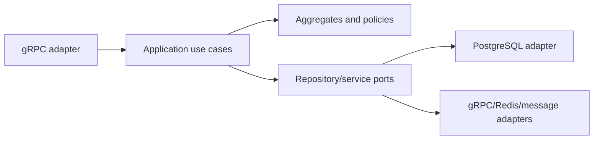
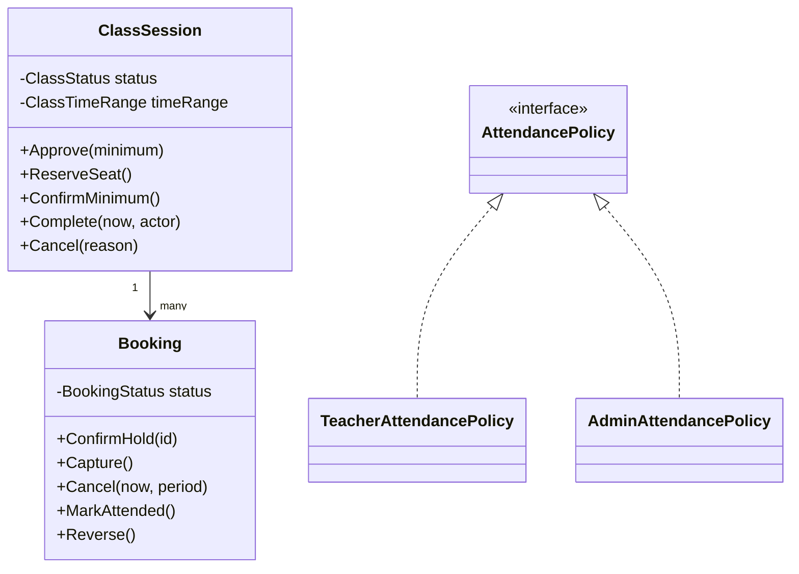
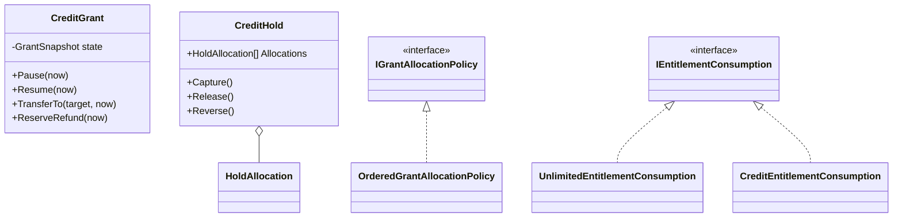
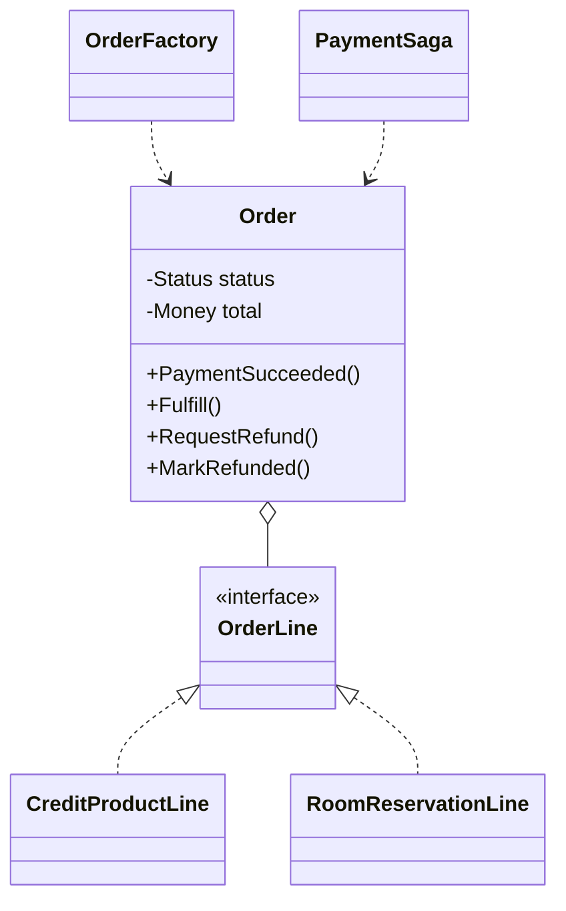
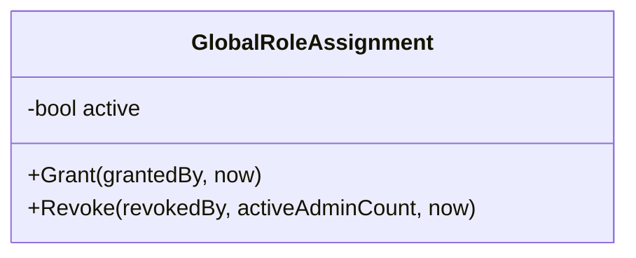

# ADR-001: Core domain objects and ports

Status: Accepted

## Context

Scheduling, Credit, and Orders originally placed authorization, state transitions, SQL, event creation, and gRPC mapping in the same service classes. The code worked, but business invariants could only be tested through transport or database code and the object-oriented design was difficult to see. Account and Catalog were built the same flat way and, for a while, stayed that way deliberately: Account's only real state machine (granting and revoking the `platform_admin` global role) and Catalog's read-only queries seemed too small to justify the extra layers. Once Account's grant/revoke handler needed the same self-revocation and last-administrator invariants as any other aggregate, the inconsistency stopped being a size argument and became just an unconverted service, so it was brought in line with the rest.

## Decision

Use a lightweight domain model with ports and adapters for Scheduling, Orders, Credit, Account, Catalog, and Chat. The domain layer follows each context's actual complexity: Scheduling, Orders, Credit, and Account model aggregates with state transitions and invariants; Chat models conversation and message rules; Catalog represents read-only projections of studios, rooms, and products with a thin domain package of value types.

This layering describes those six services. Cart keeps validation, cart mutations, and retry coordination in `CartGrpcService`, with persistence behind `ICartStore` and its Redis implementation. Payroll keeps authorization, SQL queries, and response assembly in its gRPC handler in `cmd/payrollservice/main.go`, which calls a local `calculatePay` helper. Its separate `internal/payroll/projection` package consumes versioned Scheduling facts from Kafka and maintains the payroll read model. Cart and Payroll do not use the domain/application/infrastructure layering shown below; a dedicated projection package does not imply a domain aggregate model.

For the layered services, domain packages keep business rules independent of protobuf, gRPC, PostgreSQL, Redis, and telemetry libraries. Aggregates and policies express business behavior, while read projections expose value types. Application services coordinate transactions, identity, idempotency, and outbox writes where needed. Adapters translate domain errors into transport errors.

The layered Go services use small interfaces and composition. Credit's C# implementation uses sealed aggregates, immutable record structs, injected interfaces, and a transport adapter based on the generated gRPC class. Polymorphism is visible in attendance, credit allocation, entitlement consumption, and refund policies.

The concrete implementation is organized as follows:

- `src/dancehub/internal/scheduling/domain` and `application`: scheduling aggregates, policies, unit-of-work and repository/service ports.
- `src/creditservice/Domain`, `Application`, `Infrastructure` and `Transport`: the complete C# dependency direction, including the gRPC adapter and multi-grant hold allocations.
- `src/dancehub/internal/orders/domain` and `application`: order aggregate, typed lines, factory, refund policies, saga and ports.
- `src/dancehub/internal/account/domain` and `application`: profile and membership value objects and the `GlobalRoleAssignment` aggregate, which owns the grant/revoke lifecycle (self-revocation, already-active/inactive, and last-administrator invariants) that used to live as branches in the accountservice gRPC handlers.
- `src/dancehub/internal/catalog/domain` and `application`: studio, room, and credit-product view types with no aggregate behavior — Catalog is a read-only projection, so there is nothing to protect with state-transition methods, and the domain package says so rather than inventing complexity to match the other services.
- `src/dancehub/internal/chat/domain` and `application`: conversation membership and message rules, coordinated through repository, identity, media, and realtime ports.
- `src/dancehub/internal/payroll/projection`: event validation, a PostgreSQL store and a Kafka consumer. Inbox insertion and version-guarded fact updates commit together; Kafka offsets are acknowledged manually after the database transaction. On processing or commit failure the consumer restarts from the committed offset, allowing inbox deduplication to absorb replay. This is a read-model adapter and consumer, not an additional layered domain service.
- `database/migrations/001_baseline.sql` (`credit.holds`, `credit.hold_allocations`, `credit.grants.fulfillment_key`): per-grant hold allocations and transfer-safe fulfillment idempotency.
- Domain cases in `tests/creditservice-domain` and the Go domain packages exercise model behavior without a running database or gRPC server.
- `tests/cartservice` exercises the gRPC handler directly with an in-memory store and a test `ServerCallContext`, including validation and concurrent-update behavior. These tests require no running Redis or gRPC server, but still use generated protobuf messages and gRPC types.

## Domain model

`Revoke` takes `activeAdminCount` as a parameter rather than querying for it: the domain layer cannot see the database, so whether revoking this assignment would leave the platform with no administrator is a fact the application layer must compute (via a lock-guarded count) and hand in. Catalog has no equivalent diagram — its domain package is `Studio`, `Room`, `CreditProductVersion`, and `CampaignSnapshot` value types with no methods to draw.

## Consequences

- Business rules in the domain models are unit-testable without a running database or gRPC server.
- PostgreSQL constraints and RLS remain final concurrency and tenant-safety guards.
- Adding a new refund or allocation rule means adding a policy implementation rather than branching in a handler.
- More mapping code is required at boundaries; generated DTOs are deliberately not domain entities.
